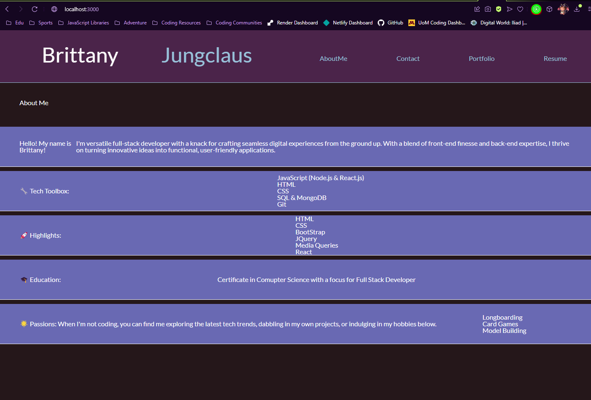

# 20 React: React Portfolio

## The Introduction: 

Hello! My name is Brittany Jungclaus and this is my portfolio. 

This portfolio application has been meticulously crafted and designed to serve as a comprehensive showcase of my projects, resume, and skills. With catering specifically to potential employers, clients, and individuals with a keen interest in exploring my body of work. 

Leveraging the power of React, an open-source JavaScript library renowned for its ability to construct seamless user interfaces, this application seamlessly operates as a one-page interface, intricately simulating the immersive experience of navigating through multiple pages.

* Notice: This is all Client-End in its current state, and will be updated accordingly to be able to handle form submissions and resume downloads very soon!

## Table of Contents

* [Introduction](#the-introduction)

* [Technology Stacks](#technology-stacks)

* [Installation](#installation)

* [Challenges](#challenges)

* [Mock-Up](#mock-up)

* [Vers. 2.0](#vers.-2.0)

* [Deployed Application](#deployed-application)

## Technology Stacks:
- React
- Bootstrap

#### npm Packages:
- Express.js

## Installation:
- Step 1: While in the Root File, open your terminal and type the command: npm run dev

## Challenges:
- I ran into a lot of frusteration when it came to the styling for react. There are some components that I need to work on in the Portfolio.

- React is super cool with its hot-reloading, however if ther is even a single spelling error or inconsitancy the whole site will stop working. It made me really became more dedicated for better consistancy accross my code. 

## Mock-Up:

The following screenshot shows the web application's appearance and functionality:

Home Page / About Me Page: 

## Vers. 2.0:
- I would like to impliment some animations, I have done some research for other portfolios and goodness the potenial is amazing!

- I may have 2 forms, one for contacting for freelance work and the other for content creation contracts

- I will be adding more projects in the future as I create them! Maybe a 'preview' for my work would be more beneficial vs an actaul visit to the site - like a portal to it instead of a new window.

## The Deployment:

The Repository: [Click Here.](https://github.com/NovaLanceBrittany/HW-20-React-Portfolio)

The Netlify: [Click Here.](https://brittanyjunclausportfolio.netlify.app)

